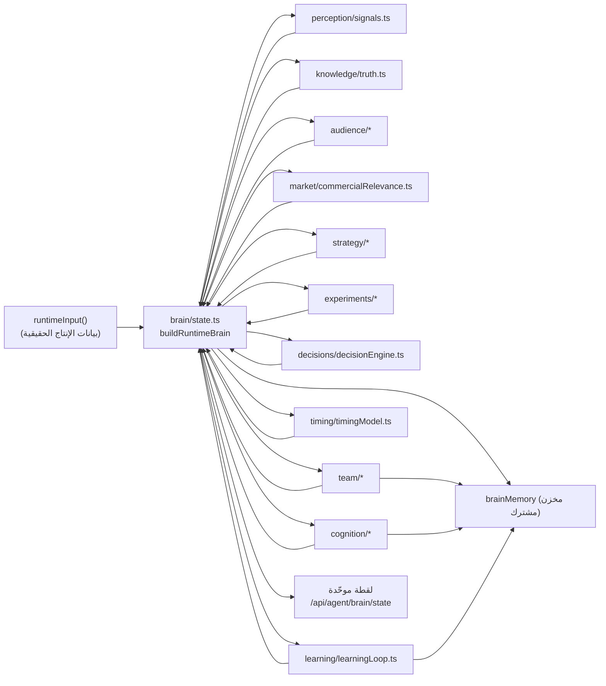
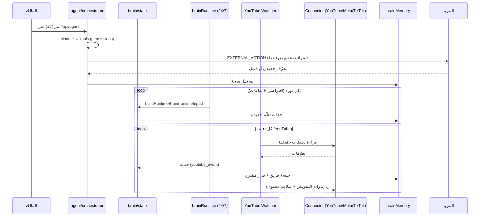

# العقول والأنظمة الذكية ومسارات التسليم (AI BRAINS & HANDOFFS)

> مرجع الحالات: [`STATUS_LEGEND.md`](./STATUS_LEGEND.md) · المصدر: قراءة `engine/brain/**`
> و`engine/agent/**` بتاريخ 2026-10-09.

## 0) التمييز الجوهري (قبل السرد)

يوجد في المشروع **ثلاث فئات مختلفة** لا يجوز خلطها:

| الفئة | أمثلة | هل تتخذ قراراً؟ | هل تنفّذ خارجياً؟ | تخزين خاص؟ |
|---|---|---|---|---|
| **محرّكات برمجية حتمية** | `planner`, `capabilityMatrix`, `comments.ts`, `contentPipeline` | لا (منطق) | لا | لا |
| **نماذج/جدار AI** | `engine/ai/engine.ts` + Gemini | لا (توليد نص) | لا | لا |
| **وحدات تحليل/توصية (تُسمى «عقول»)** | `strategyEngine`, `decisionEngine`, `learningLoop`, `team/*` | توصية/قرار **مقترح** | **لا** | لا (مخزن مشترك) |

**لا يوجد أي «عقل» مستقل يعمل ذاتياً.** العقل الوحيد المنسّق هو `engine/brain/runtime.ts`
+ `engine/brain/state.ts` (المخزن/التجميع)، والقرار يُنتج **مقترحاً** يمرّ ببوابات التنفيذ.

## 1) خريطة العقول/الوحدات

## 2) وصف كل وحدة (مهمة · مستدعى بـ · مدخلات · مخرجات · يسلّم لمن · قرار؟ · تخزين · إنتاج؟)

| الوحدة (ملف) | المهمة | من يستدعيها | مدخلات | مخرجات | تُسلّم إلى | قرار؟ | تخزين | إنتاج؟ |
|---|---|---|---|---|---|---|---|---|
| `brain/perception/signals.ts` | إشارة موحّدة لكل مؤشر (مصدر/طزاجة/تطبيع) | `state.ts` | بيانات مساحة العمل | إشارات (والمتاح/غير المتاح) | `state` | لا | مشترك | 🟢 CODE |
| `brain/knowledge/truth.ts` | فصل الحقيقة عن الاستنتاج/الفرضية | `state`, `team` | وقائع | حقائق مصنّفة | `state`/`memory` | لا | مشترك | 🟢 CODE |
| `brain/audience/*` | نموذج جمهور من تفاعل حقيقي فقط | `state` | تعليقات/تفاعل | مقاطع سلوكية (فرضية حتى عيّنة) | `state` | لا | مشترك | 🟢 CODE |
| `brain/market/commercialRelevance.ts` | قُمع تجاري VIEW→…→SALE | `state`, `runtime`, `dryRun` | إشارات | مراحل ولاء | `state` | لا | مشترك | 🟢 CODE |
| `brain/strategy/capabilityMatrix.ts` | مصفوفة قدرات مشتقّة من `PLATFORM_SPECS` | `state`, `strategyEngine` | `registry.ts` | AVAILABLE/PARTIAL/… | `strategyEngine` | لا | مشترك | 🟢 CODE |
| `brain/strategy/strategyEngine.ts` | توصيات قابلة للتفسير | `state` | إشارات/قدرات | recommendation+evidence+confidence | `state`/`memory` | لا (توصية) | مشترك | 🟢 CODE |
| `brain/strategy/contentIntelligence.ts` | مسار محتوى + جودة + أداء متعدد الأبعاد | `state` | سجلات نشر | تحليل | `state` | لا | مشترك | 🟢 CODE |
| `brain/experiments/experimentEngine.ts` | تجارب بمتغيّر واحد + حكم `inconclusive` | `state` | نتائج | تجربة/حكم | `state` | لا | مشترك | 🟢 CODE |
| `brain/decisions/decisionEngine.ts` | تصنيف القرار ومستويات L0..L5 | `state`, `routes` | توصيات | قرار مقترح (آلي/مقترح/بشري/محجوب) | API/المالك | لا (يوجّه) | مشترك | 🟢 CODE |
| `brain/learning/learningLoop.ts` | تعلّم من الأحداث + تفضيل المالك | `state`, runtime | أحداث | تعديلات توصية/قواعد | `memory` | لا | مشترك | 🟢 CODE |
| `brain/timing/timingModel.ts` | توقيت Asia/Baghdad (مصدر واحد) | `state` | تفاعل | نافذة زمنية | `state` | لا | مشترك | 🟢 CODE |
| `brain/cognition/*` | حلقة معرفية: تخطيط/سياق/قرار/تعلّم النتائج | `state`, `routes` | واقع + ذاكرة | تقرير معرفي + working memory | `memory`/API | لا (مقترح) | مشترك | 🟢 CODE* |
| `brain/team/*` | فريق داخلي (بحث/تحليل/استراتيجية/نقد/قرار) | watcher + `routes` | حدث حقيقي | جلسة + قرار مقترح | `brainMemory` | لا (مقترح) | مشترك | 🟢 CODE |
| `brain/brainRuntime.ts` | تشغيل العقل 24/7 (دورة داخلية) | `server.ts` | بيانات إنتاج | دورة + ذاكرة جديدة | `brainMemory` | لا | مشترك | 🟢 CODE* |
| `brain/state.ts` / `runtime.ts` | التجميع الموحّد | `routes`, `routes.ts` | كل ما سبق | لقطة/ملخص | API/واجهة | لا | — | 🟢 CODE |
| `agent/planner.ts` | تصنيف نية حتمي + خطة خطوات | `orchestrator` | أمر المالك | خطة | `orchestrator` | لا | — | 🟢 CODE |
| `agent/tools.ts` | سجل ٣٠ أداة مرتبطة بوظائف الخادم | `orchestrator` | معاملات | نتائج أدوات | `orchestrator` | حسب الأداة | — | 🟢 CODE |
| `agent/orchestrator.ts` | تنفيذ/إعادة/تحقق/سجل | `routes` | خطة | مهمة + حالة | `agentMemory` | بوابة تفويض | مشترك | 🟢 CODE |
| `agent/permissions.ts` | صلاحيات الأدوات (5 مستويات × staff/owner/system) | `orchestrator` | دور + أداة | سماح/حجب | `orchestrator` | حاسم | — | 🟢 CODE |

`*` = الوحدة مُختبَرة؛ لا إثبات تنفيذها على أحداث إنتاج حقيقية بمعرّف مزود في هذه الوثيقة
(انظر `AUTOMATION_MEMORY_AND_LEARNING.md` للمراقب 24/7).

## 3) مسارات التسليم (من يسلّم لمن ومتى)

## 4) من يملك القرار النهائي؟

- **النظام لا يقرّر تنفيذاً خارجياً بنفسه.** `decisionEngine` يُصنّف ويوجّه؛
  `executionPolicy`/`permissions`/`delegationCheck` تحكم ما إذا كان الفعل مسموحاً.
- أفعال مثل النشر والحذف وتغيير الإعدادات => `human_required` دائماً.
- YouTube مُفوَّض (owner→system) بنطاق محدّد (`reply/publish/schedule/update_video`)
  بعد منح المالك — قبل المنح تبقى المهام `waiting`.

## 5) الثغرات/العوائق المثبتة

- 🔴 لا يوجد تدريب ذاتي للنموذج (AI لا «يتعلّم» بمعنى ضبط الأوزان — التعلّم = قواعد/ذاكرة).
- 🟠 العقول تُنتج توصيات، لكن حلقة «تطبيق التوصية وقياس الأثر» تعتمد على تنفيذ المالك.
- 🟠 لا يوجد brain/commercial أو sales/growth (حُذفت في `cc6e86f` خارج النطاق).
