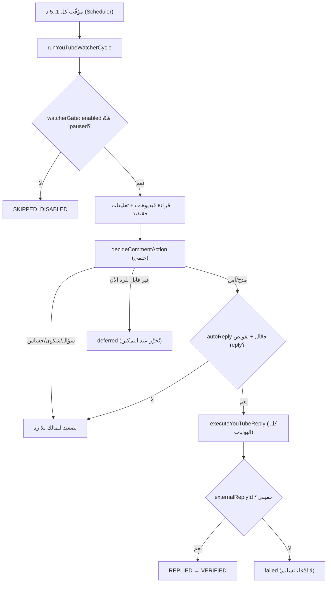
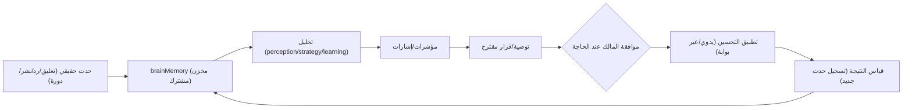

# الأتمتة والذاكرة والتعلّم والتحسين (AUTOMATION, MEMORY & LEARNING)

> مرجع الحالات: [`STATUS_LEGEND.md`](./STATUS_LEGEND.md) · المصدر: `server.ts`
> (مؤقّتات + registrations)، `engine/social/youtubeWatcher*.ts`, `engine/dr/autoBackup.ts`,
> `engine/brain/brainRuntime.ts`.

## 1) كل مؤقّت/مهمة خلفية فعلية

| المهمة | المُنشئ | التخزين | المُشغّل | الشرط | منع التكرار | الدليل |
|---|---|---|---|---|---|---|
| YouTube Watcher 24/7 | `startYouTubeWatcher()` | `youtubeWatcher` (مخزن مشترك) | `youtubeWatcherScheduler.ts` (مؤقّت واحد) | `enabled && !paused`، بالفاصل 1..5 دقائق | `hasProcessed` + `update_id`/externalId | 🟢 CODE+TEST |
| Brain Runtime 24/7 | `startBrainRuntime()` | `control.brainRuntime` | `setInterval` | الإيقاع 6h (5د..24س)، مستحق بالزمن | قفل/lease + منع تكرار الأحداث | 🟢 CODE+TEST |
| TikTok reconcile | `tiktokReconcileTimer` | سجل النشر | `setInterval` | سجل غير محسوم + اتصال موثق | `shouldReconcileTikTokRecord` | 🟢 CODE+TEST |
| Safe-job preflight | `safeJobWorkerTimer` | `jobs` | `setInterval` (60s) | مهام جاهزة | خصائص المهمة | 🟢 CODE |
| DR hourly reconciliation | `drReconciliation.start()` | `control.driveReconciliation` | `setInterval` (60m) | تغيّر مصدر + `complete` | قفل `backupRunning` | 🟢 CODE+TEST |
| DR full auto-backup | `drAutoBackup.start()` | `control.driveAutoBackup` | `setInterval` (6h) | استحقاق بالزمن | `backupRunning` + in-flight | 🟢 CODE+TEST |
| Runtime cleanup | `runtimeCleanupTimer` | — | `setInterval` (5m) | — | — | 🟢 CODE |

كل المؤقّتات `.unref()` وتعمل داخل عملية Render (لا تعتمد على المتصفح)، وتُوقف عند SIGTERM/SIGINT.

## 2) YouTube Watcher — التفصيل

- **منع التكرار:** حالة `processed` + `hasProcessed`؛ المؤجَّل يُحرَّر فقط عند تغيّر الإعداد.
- **التصعيد:** سبب مرتبط بالمضمون فقط (سعر/شكوى/حساس) — لا تصعيد كاذب بسبب الإعداد.
- **التقارير:** `/api/agent/youtube/watcher/brief` + `details?metric=` (الرقم = نفس السجلات).

## 3) الذاكرة والتعلّم

**مصادر الذاكرة الفعلية (مفاتيح التخزين):** `brainMemory`, `workingMemory`,
`centralBrainStrategy`, `centralBrainDecisionLedger`, `teamSessions`, `agent`, `control`
(وفيه `youtubeDelegation`, `brainRuntime`, `driveReconciliation`, `driveAutoBackup`, `keyVault`).

## 4) ماذا يتعلّم النظام فعلاً؟ (بلا مبالغة)

| النوع | موجود فعلاً؟ | التفصيل |
|---|---|---|
| حفظ البيانات التاريخية | 🟢 نعم | أحداث/تعليقات/نتائج في المخزن المشترك. |
| تحسين التوصيات بمعرفة متراكمة | 🟢 نعم | `learningLoop` + `outcomeLearning` + تفصيل التوصية بالأدلة. |
| تعديل قواعد/عتبات | 🟢 جزئي | قواعد حتمية + تفضيل المالك (ليس تعلّم أوزان). |
| تجارب A/B بحكم صادق | 🟢 نعم | `experimentEngine` (inconclusive بلا عيّنة كافية). |
| **تدريب ذاتي للنموذج (weights)** | 🔴 **لا** | غير موجود — لا يُوصف بأنه «يدرّب نفسه». |

## 5) المهام التي تعمل فعلاً في الإنتاج (تحقق حي)

- YouTube Watcher: نشط (`watcherActive`)؛ لكن الرد الآلي يعتمد على `autoReply` +
  تفويض YouTube من المالك (🟠 حتى يُمكّنها).
- Brain Runtime: يعمل عند استحقاق الإيقاع (🟢 `brainRuntime` في health).
- DR reconciliation + auto-backup: مؤقّتات مُعدّة، وتتطلب `DRIVE_OAUTH_*`/`DR_STATE_DATABASE_URL`
  لتشغيل فعلي (🟠/`EXTERNAL`).

## 6) التمييز المطلوب

- **جدولة برمجية** = المؤقّتات أعلاه (موجودة).
- **تنفيذ فعلي** = يقع فقط عند استيفاء البوابات + (للخارجي) تفويض/موافقة المالك.
- **توصيات تحتاج موافقة** = قرارات العقل/الفريق — لا تُنفَّذ تلقائياً.
