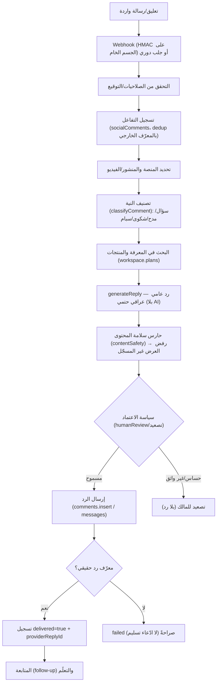

# التفاعلات وخدمة الزبائن ومستودع المعرفة (CUSTOMER INTERACTIONS & KNOWLEDGE)

> مرجع الحالات: [`STATUS_LEGEND.md`](./STATUS_LEGEND.md) · المصدر: `engine/social/{comments,
> conversationIntelligence,contentSafety,telegram,facebook,instagram}.ts`, `server.ts`.

## 1) دورة التفاعل (تعليق/رسالة واردة → متابعة)

## 2) أين تُخزّن التعليقات/الرسائل

- `socialComments`, `socialReplies`, `publishRecords`, `performanceRecords`,
  `marketingDecisions` — داخل `workspace`، ويصمدان عبر طرفَي الحفظ
  (`loadPersistentState`/`buildPersistedState`) في ملف الحالة/Postgres.
- منع التكرار بـ`externalId` (مثال Telegram: `tg:<chatId>:<messageId>`) و`update_id` —
  يصمد بعد restart، فيمنع webhook replay.

## 3) ربط المحادثة بالمنتج/المنشور

- الربط **بمعرّف صريح** (`productId`) من السجل — لا استنتاج من نص التعليق.
- سياق المنشور/الفيديو يُحفظ مع التعليق (platform + post/video id).

## 4) كيف يسترجع العقل السياق ويحدّد نوع السؤال

- `classifyComment` (حتمي) يستخرج: `intent` (question/praise/complaint/spam/other)،
  `topic` (location/price/availability/hours/general)، `subIntent` (thanks/blessing/…)،
  `isEmojiOnly`، `sentiment`. توحيد الألف/التاء/الهمزات يمنع فقدان «وين» مقابل «أين».
- لا يستهلك AI: التصنيف حتمي ومتاح دائماً (بلا حصة).

## 5) عند غياب إجابة موثوقة

- `generateReply(classification, facts, context)`:
  - حقيقة موجودة (سعر/موقع/دوام مسجّل) => رد يذكرها.
  - حقيقة غائبة => `needsInfo=true` + إحالة للرسائل **بلا اختراع** رقم/عنوان/سعر.
  - شكوى/حساس => `complaint_escalate` (تحويل بشري).
- حارس `contentSafety.ts` يرفض (422) أي نص يحمل عرضاً/رقماً/رابطاً غير مسجّل.

## 6) منع تكرار الرد وتحويل الحالة للمالك

- منع التكرار: حماية على معرّف التعليق الخارجي + `replyInFlightLock.ts`.
- التصعيد: حالات حسّاسة/سبام => مراجعة بشرية إلزامية (لا رد آلي)؛ `escalation.ts` +
  `watcherAlerts.ts` تُنتج تنبيهات للـwatcher.

## 7) أي منصات تدعم ماذا (فعلياً)

| المنصة | قراءة تعليقات | رد على تعليق | رسائل | رد على رسالة |
|---|---|---|---|---|
| Facebook | نعم | نعم | نعم | نعم |
| Instagram | نعم | نعم | نعم | نعم |
| YouTube | نعم | نعم | لا | لا |
| Telegram | لا (Bot API) | لا | نعم | نعم |
| TikTok | **لا** | **لا** | **لا** | **لا** |
| Threads | لا (منفّذ) | لا | لا | لا |
| WhatsApp/X/Snapchat/GoogleBusiness | لا/مخطّط | — | WhatsApp: رسائل فقط | — |

## 8) المستودع التجاري ومصدر الحقيقة لكل معلومة

الدلالة الحرفية مفردات `ReplyFactSet` (تُحقن من `server.ts` من بيانات المعرض الفعلية):

| المعلومة | مصدر الحقيقة الفعلي | ملاحظة |
|---|---|---|
| اسم المنتج | `workspace.products[].name` | مسجّل |
| السعر | `workspace.products[].price` / خطة ذات سعر | يُذكر فقط إن كان مسجّلاً |
| المواصفات | `workspace.products[].specs` | مسجّل |
| العروض | لا مصدر مخصص موثّق | إن وُجد يُروى من المحتوى المعتمد |
| التقسيط | `workspace.installmentPlans` أو `durationMonths`/`downPaymentPercent` | تُشتق حتمياً من سعر مسجّل |
| التوفر | `workspace.products[].availability` | إن كان مسجّلاً |
| الموقع/الدوام/تواصل | بيانات المعرض (`buildFacts` في `server.ts`) | مسجّل |

**منع الاختلاق:** `contentSafety.ts` (`analyzeBusinessClaims` / `buildSafeBusinessReply`) +
`replyIntelligence` تُوسم الحقائق المستخدمة (`usedFacts`)؛ غياب الحقيقة => `needsInfo`.

## 9) حدود وثغرات

- 🟠 العروض التجارية بلا نموذج بيانات مخصّص (تُروى من محتوى معتمد فقط).
- 🟠 لا تدريب ذاتي للنموذج — التحسّن عبر قواعد/ذاكرة لا أوزان.
- 🔴 Threads/TikTok لا يدعمان التفاعل عبر الواجهة العامة.
