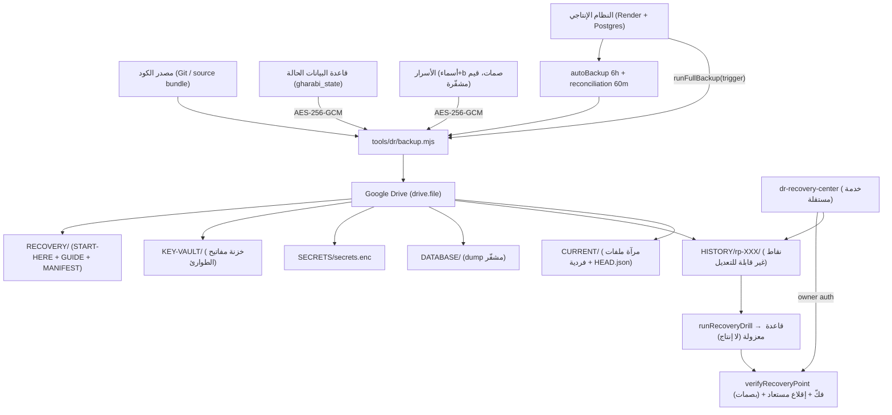

# الاستنساخ والنسخ الاحتياطي والتعافي (DR, RECOVERY & CLONING)

> مرجع الحالات: [`STATUS_LEGEND.md`](./STATUS_LEGEND.md) · المصدر: `engine/dr/**`,
> `tools/dr/**`, `dr-recovery-center/**`, `render.yaml`, `.env.example`.

## 1) المخطط (النظام الإنتاجي ← Drive ← مركز التعافي ← الاستعادة)

## 2) ما الذي يُنسخ فعلاً؟

| العنصر | المحتوى | التشفير | المصدر |
|---|---|---|---|
| المصدر (source) | شجرة Git المتتبَّعة (bundle حتمي) أو مشي عند غياب git | لا | `tools/dr/source-bundle.mjs` |
| قاعدة البيانات | dump للحالة مشفّر `database.enc` | AES-256-GCM | `tools/dr/db-crypto.mjs` |
| الأسرار | `secrets.enc` (أسماء + بصمات؛ قيم مشفّرة) | AES-256-GCM (scrypt) | `tools/dr/secret-crypto.mjs` |
| خزنة المفاتيح | `KEY-VAULT/` (HEAD + KV-N + current.enc) | مفتاح مستقل `DR_RECOVERY_VAULT_KEY` | `engine/dr/recoveryVault/*` |
| CURRENT | مرآة ملفات فردية متداخلة + بيان | لا | `tools/dr/current-mirror.mjs` |

## 3) ما الذي يمكن استعادته؟

- 🟢 **الكود**: من bundle/Git.
- 🟢 **قاعدة البيانات الحالة**: من `database.enc` بمفتاح master (أو بديل مفتاح التوكنات).
- 🟢 **الأسرار**: من `secrets.enc` (بالمفتاح الرئيسي).
- 🟢 **مفاتيح الطوارئ**: من `KEY-VAULT` بالمفتاح المستقل (لا يُخزَّن داخل الخزنة).
- 🔴 **اتصال المنصات**: يحتاج إعادة OAuth (رموز مشفّرة داخل قاعدة الحالة؛ تُستعاد إن فُكّت
  قاعدة الحالة، لكن إعادة التفويض قد تلزم لأي رمز مُبطل) — عملية منفصلة.

## 4) الفصل الإلزامي بين العمليات

| العملية | مستقلة؟ | الملف |
|---|---|---|
| استنساخ الكود | نعم | `source-bundle.mjs` / Git |
| استعادة قاعدة البيانات | نعم | `restore-db.mjs` / `restore.mjs` |
| استعادة إعدادات التشغيل | نعم | env vars (خارج الكود) |
| استعادة اتصال المنصات | **لا تُدمج مع ما سبق** | OAuth متجدد |

## 5) الحالة والدليل

| البند | الحالة | الدليل |
|---|---|---|
| منظومة DR كاملة | 🟢 | CODE + TEST (`engine/tests/dr/**`) |
| اختبار استعادة معزول حقيقي (Postgres مدمجة) | 🟢 | TEST (`dr.real-drill.test.ts`) |
| اختبار فقدان كل المفاتيح (All-Keys-Lost) | 🟢 | TEST (`dr.lostkeys.test.ts`) |
| مركز تعافٍ مستقل + مصادقة مالك | 🟢 | CODE+TEST (`tools/dr/recoveryAuth.mjs`) |
| نسخة تلقائية كل 6 ساعات | 🟢 (كود/اختبار) | CODE+TEST (`dr.autoBackup.test.ts`) |
| **نسخة حقيقية على Google Drive في الإنتاج** | 🟠 | `EXTERNAL` — تتطلب `DRIVE_OAUTH_*`/`DR_STATE_DATABASE_URL` من المالك |
| إعادة نشر إنتاجية | 🔴 | لا استعادة إنتاجية تلقائية (`/restore/production` يرد 428/501) |
| استعادة اتصال المنصات | 🟠 | OAuth منفصل |

## 6) نقاط الفشل/الاعتماديات المنفردة

- 🔴 **Google Drive** نقطة اعتماد منفردة للنسخ السحابي (لا مزوّد ثانٍ).
- 🟠 مفتاح `DR_RECOVERY_VAULT_KEY` حرج ولا يُخزَّن داخل الخزنة (يجب حفظه خارج النظام).
- 🟠 `DR_STATE_DATABASE_URL` مطلوب لمركز التعافي لقراءة رمز Drive المشفّر من قاعدة الحالة.
- 🟢 لا حذف تلقائي لنقاط الاستعادة المحميّة (`rp-002/003/004`); الاحتفاظ 3 نقاط مكتملة.

## 7) هل تم اختبار الاستعادة فعلياً؟

- 🟢 نعم، في بيئة **معزولة** (Postgres مدمجة): فكّ + استعادة مصدر + إقلاع مستعاد + فحص
  `/api/health` (backend=postgres) و`/api/readiness` (applicationReady).
- 🟠 لم يُثبت (في هذه الوثيقة) تنفيذ استعادة على **Drive حقيقي بالإنتاج** — يحتاج اعتماد
  المالك؛ الكود والقدرة موجودان ومُختبَران على Drive وهمي بعقد REST نفسه.
