# الغرابي AI — المخطط الهندسي الرئيسي (MASTER ARCHITECTURE)

> مرجع الحالات والألوان: [`STATUS_LEGEND.md`](./STATUS_LEGEND.md).
> نطاق هذه الوثيقة: الصورة العامة للمشروع كما هو **فعلاً** في الكود والإنتاج (لا كما ينبغي أن يكون).
> تاريخ الفحص: 2026-10-09 · آخر commit مفحوص: `bb004fe` · الإنتاج الحي: `bb004fe`.

## 1) الملخص التنفيذي

`al-gharabi-ai` تطبيق ويب عربي (RTL) أحادي العملية: خادم Express مركزي واحد
(`server.ts`، ~15,575 سطراً) يضم كل المسارات والحالة والمصادقة، ويُغلَّف بـReact/Vite
للواجهة، وبـ`netlify/functions/api.ts` للنشر على Netlify، وبـ`Dockerfile`/`render.yaml`
للنشر على Render. النطاق الرسمي: **سوشيال + AI + تسويق** — وليس ERP.

الطبقات الفعلية (مثبتة بالكود): مصادقة جلسات موقّعة بلا حالة → عقل مركزي (تحليل/توصية/
تعلّم) + منسّق مهام تنفيذي → محرّك AI محصن (Gemini) + جدار حصة → الذاكرة ومخازن الحالة →
محرك أتمتة/جدولة (مؤقّتات داخلية) → موصلات منصات (Telegram/Facebook/Instagram/TikTok/
YouTube/Threads حقيقية؛ البقية أساس) → تخزين دائم (ملف أو Postgres) → مراقبة/تقارير/أمان →
نسخ احتياطي وتعافٍ (Google Drive DR + مركز تعافٍ مستقل).

## 2) المخطط الرئيسي (Mermaid) — الطبقات والتدفق

```mermaid
flowchart TB
  subgraph L1["1) المالك وواجهة عربية (src/App.tsx · 5 أقسام)"]
    UI["React/Vite RTL<br/>Sidebar + SectionHub + Views"]
  end

  subgraph L2["2) المصادقة والصلاحيات (engine/auth)"]
    AUTH["جلسات HMAC بلا حالة<br/>sessions.ts · challenge.ts<br/>authenticateToken / requireOwner"]
  end

  subgraph L3["3) العقل المركزي والمنسّق"]
    CB["Central Brain (engine/brain)<br/>state · runtime · cognition · team · decisions"]
    AG["Agent Orchestrator (engine/agent)<br/>planner · tools · orchestrator · permissions"]
    RT["Brain Runtime 24/7 (brainRuntime.ts)<br/>دورة داخلية دورية"]
  end

  subgraph L4["4) العقول المتخصصة ومحرّكات القرار"]
    PERC["perception/signals"]
    KNOW["knowledge/truth"]
    AUD["audience/*"]
    MKT["market/commercialRelevance"]
    STR["strategy/* (capabilityMatrix · strategyEngine · contentIntelligence)"]
    EXP["experiments/*"]
    DEC["decisions/decisionEngine"]
    LRN["learning/learningLoop"]
    TIM["timing/timingModel"]
    COG["cognition/* (cognitiveLoop · planningEngine · outcomeLearning)"]
    TEAM["team/* (researchAgent … decisionAgent …)"]
  end

  subgraph L5["5) الذاكرة والمعرفة والبيانات التجارية"]
    MEM["memory/store · memory/longTerm"]
    WM["workingMemory · decisionLedger · strategyState"]
    WS["workspace: products · installmentPlans · sales · conversations"]
  end

  subgraph L6["6) الأتمتة والجدولة والأحداث"]
    YW["YouTube Watcher 24/7 (youtubeWatcher.ts + Scheduler)"]
    TK["TikTok reconcile timer"]
    SJ["Safe-job preflight timer"]
    DRA["DR hourly reconciliation + 6h auto-backup"]
  end

  subgraph L7["7) طبقة الخدمات و API (server.ts + engine/*/routes.ts)"]
    API["/api/platforms · /api/workspace · /api/agent · /api/ai<br/>/api/brain · /api/dr · /api/control · /api/social·manager"]
  end

  subgraph L8["8) موصلات المنصات (engine/social)"]
    CONN["Telegram · Facebook · Instagram · TikTok · YouTube · Threads<br/>(realConnector=true) | WhatsApp/X/Snapchat/GoogleBusiness (أساس)"]
  end

  subgraph L9["9) قاعدة البيانات والتخزين الدائم (engine/storage/adapter.ts)"]
    STORE["ملف محلي (.gharabi-state.json) أو Postgres<br/>جدول واحد: gharabi_state(key,value,updated_at)"]
  end

  subgraph L10["10) المراقبة والتقارير والأمان"]
    OBS["/api/health · /api/readiness · audit · healthPrivacy · escalation"]
  end

  subgraph L11["11) النسخ الاحتياطي والتعافي (engine/dr + tools/dr)"]
    DR["Google Drive DR: CURRENT mirror + HISTORY rp-XXX<br/>DB مشفّرة + secrets.enc + KEY-VAULT + مركز تعافٍ مستقل"]
  end

  subgraph L12["12) الخدمات الخارجية ومزودو AI"]
    EXT["Google Gemini (engine/ai) | Meta Graph | Google (YouTube/Drive) | TikTok | Telegram"]
  end

  UI --> AUTH --> API
  API --> CB
  API --> AG
  API --> CONN
  AG --> CB
  CB --> PERC & KNOW & AUD & MKT & STR & EXP & DEC & LRN & TIM & COG & TEAM
  CB --> MEM & WM
  MEM -.-> WS
  RT --> CB --> MEM
  YW --> CONN
  YW --> CB
  YW --> MEM
  API --> STORE
  CB --> STORE
  DR --> STORE
  OBS --> STORE
  CB --> EXT
  AG --> EXT
  CONN --> EXT
  DR --> EXT
```

**قراءة الأسهم:** `UI→AUTH→API` أمر المالك؛ `API→CB/AG` التوجيه للعقل؛
`CB→(عقول متخصصة)` تحليل/قرار؛ `YW→CONN` التنفيذ الخارجي عبر البوابات؛
`*→STORE`/`→MEM` عودة النتائج للذاكرة؛ `OBS` يقرأ الحالة (قراءة فقط).

## 3) الطبقات: المسؤولية والوحدات والدليل والحالة

| # | الطبقة | الوحدات الفعلية | الحالة | الدليل |
|---|---|---|---|---|
| 1 | الواجهة العربية | `src/App.tsx`, `src/components/common/{Sidebar,SectionHub}.tsx`, `src/components/**` (٥ أقسام أم) | 🟢 | `CODE`+`TEST` (unified.nav) |
| 2 | المصادقة/الصلاحيات | `engine/auth/{sessions,challenge}.ts`, `authenticateToken`, `requireOwner`, `engine/agent/permissions.ts` | 🟢 | `CODE`+`TEST`+`PRODUCTION` |
| 3 | العقل المركزي والمنسّق | `engine/brain/{state,runtime,cognition,team,decisions,cycles,dryRun}.ts`, `engine/agent/{planner,tools,orchestrator,providerRouter}.ts`, `engine/brain/brainRuntime.ts` | 🟢 | `CODE`+`TEST` |
| 4 | العقول المتخصصة | `engine/brain/{perception,knowledge,audience,market,strategy,experiments,decisions,learning,timing,cognition,team}/**` | 🟢 | `CODE`+`TEST` |
| 5 | الذاكرة/البيانات | `engine/brain/memory/*`, `workingMemory`, `decisionLedger`, `workspace` | 🟢 | `CODE`+`TEST` |
| 6 | الأتمتة/الجدولة | `engine/social/youtubeWatcher*.ts`, `engine/dr/autoBackup.ts`, مؤقّتات `server.ts` | 🟢 | `CODE`+`TEST` |
| 7 | API | `server.ts` (~37 مجموعة `/api`), `engine/*/routes.ts` | 🟢 | `CODE`+`TEST`+`PRODUCTION` |
| 8 | موصلات المنصات | `engine/social/{telegram,facebook,instagram,tiktok,youtube,threads}.ts` (حقيقية) + `registry.ts` (١٠ منصات) | 🟠 | `CODE`+`TEST`+`EXTERNAL` |
| 9 | التخزين الدائم | `engine/storage/adapter.ts` (ملف/Postgres) | 🟢 | `CODE`+`TEST`+`PRODUCTION` |
| 10 | المراقبة/الأمان | `/api/health`, `/api/readiness`, `engine/social/healthPrivacy.ts`, `audit` | 🟢 | `CODE`+`TEST`+`PRODUCTION` |
| 11 | النسخ والتعافي | `engine/dr/**`, `tools/dr/**`, `dr-recovery-center/**` | 🟢 | `CODE`+`TEST` |
| 12 | الخدمات الخارجية/AI | `engine/ai/{engine,provider,firewall,models,quotaPolicy,retry,errors}.ts` | 🟠 | `CODE`+`TEST`؛ الحصة/المزود يحتاج مفاتيح (`EXTERNAL`) |

## 4) دورة البيانات (أمر المالك → نتيجة → ذاكرة)

1. المالك يُرسل أمراً من الواجهة → `POST /api/agent/*` أو `/api/platforms/*` (بجلسة موقّعة).
2. `authenticateToken` يتحقق؛ `requireOwner` للأفعال الحسّاسة.
3. المنسّق (`engine/agent/planner.ts`) يصنّف النية حتمياً → خطة خطوات → `tools.ts` ينفّذ.
4. الخطوات `EXTERNAL_ACTION` تُحجب بلا تفويض/موافقة (تبقى المهمة `waiting`).
5. محرّك AI (`engine/ai/engine.ts`) عند الحاجة: `Provider→Guard→Timeout→Retry→Cache→Fallback`.
6. النتائج تُسجَّل في الذاكرة (`memory/store`, `brainMemory`) والحالة (`storageAdapter`).
7. المراقبة (`/api/health`, `/api/readiness`) تقرأ الحالة — **قراءة فقط، بلا Gemini**.

## 5) الاعتماديات الخارجية والعوائق

- **Gemini**: مفتاح `GEMINI_API_KEY` على الخادم فقط. الإنتاج: `ai.providerReady=false`
  حتى تحقق حي (سلوك صحيح، ليس خطأً) — 🔴/`EXTERNAL`.
- **Meta (Facebook/Instagram/Threads)**: يتطلب Configuration ID وصلاحيات مُفعّلة في
  Use Case + Redirect URI — 🟠/`EXTERNAL`.
- **TikTok**: `TIKTOK_CLIENT_KEY/SECRET` + Redirect + سياق Sandbox/Production — 🟠/`EXTERNAL`.
- **Google (YouTube/Drive)**: OAuth + نطاقات؛ DR يخزّن refresh token مشفّراً في قاعدة الحالة.
- **النسخ السحابي/التعافي**: يحتاج `DRIVE_OAUTH_*` و`DR_STATE_DATABASE_URL` — 🟠/`EXTERNAL`.

## 6) ما لا تدّعيه هذه الوثيقة

- لا تدّعي زمن تنفيذ قبل 2026-09-16 (لا دليل Git).
- لا تساوي بين وجود موصل واتصال فعلي (انظر `AI_BRAINS_AND_HANDOFFS.md` و`PUBLISHING_AND_SOCIAL_FLOWS.md`).
- لا تصف أي تدريب ذاتي للنموذج (غير موجود — انظر `AUTOMATION_MEMORY_AND_LEARNING.md`).

المخططات المرافقة: [`MASTER_SYSTEM_FLOW.mmd`](./MASTER_SYSTEM_FLOW.mmd) · بقية الوثائق في نفس المجلد.
