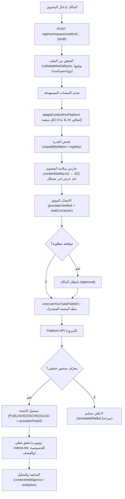
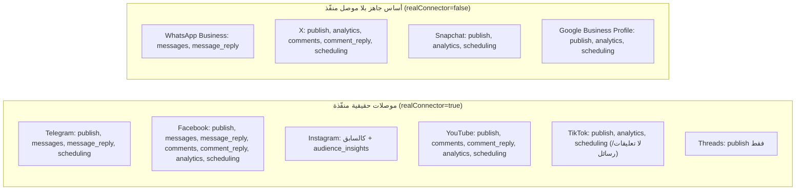

# النشر والمنصات الاجتماعية (PUBLISHING & SOCIAL FLOWS)

> مرجع الحالات: [`STATUS_LEGEND.md`](./STATUS_LEGEND.md) · المصدر: `server.ts`
> (Unified publishing pipeline)، `engine/social/{publishing,contentPipeline,registry,oauth,webhook}.ts`.

## 1) دورة النشر الموحّدة

## 2) كيف تُعالج القيود الأساسية

| الجانب | الآلية الفعلية | الملف | الحالة |
|---|---|---|---|
| إعادة استخدام الفيديو/الصورة بين المنصات | تخزين مؤقت بـ`sha256` + رفع رابط عام مرة واحدة | `server.ts` (`publicVideoUploadCache`) + `videoPublicHosting.ts` | 🟢 CODE |
| تخصيص النصوص لكل منصة | `adaptContentForPlatform` حتمي لكل منصات الطلب (نداء Gemini واحد للتوليد) | `server.ts:13595` | 🟢 CODE |
| اختلاف صيغ الوسائط/القيود | `MEDIA_REQUIRED` (إنستغرام/تيك توك)، نص فقط (فيسبوك)، تحقق توقيع الملف | `contentPipeline.ts` + `server.ts` | 🟢 CODE |
| منع إعادة النشر المكرر | `contentFingerprint` + idempotency + `DUPLICATE_PUBLISH` | `contentPipeline.ts` | 🟢 CODE |
| انتهاء الرمز/رفض الصلاحية | `reauth_needed` صريح + مسار تجديد (YouTube/TikTok) | `youtube.ts`/`tiktok.ts` | 🟢 CODE |
| فشل منصة ونجاح أخرى | توزيع مستقل لكل منصة؛ فشل واحدة لا يلغي الأخرى | `server.ts` (توزيع متعدد) | 🟢 CODE |
| تسجيل معرفات/نتائج | `providerPostId`/`providerPublishId` + سجلات النشر | `server` + `publishRecords` | 🟢 CODE |
| معرفة المالك بما نجح/فشل/ينتظر | رد التوزيع + `/api/platforms/youtube/content/queue` + أحوال صريحة | API | 🟢 CODE |

## 3) قدرات المنصات العشر (مصدر الحقيقة: `engine/social/registry.ts`)

## 4) جدول المنصات الكامل (الحالة والدليل)

| المنصة | الموصل | النشر | تعليقات/قراءة | رد | المصادقة | الحالة | الدليل |
|---|---|---|---|---|---|---|---|
| Telegram | `telegram.ts` | نص/قناة | لا (Bot API) | رسالة (`sendMessage`) | bot-token | 🟠 | CODE+TEST |
| Facebook | `facebook.ts` | منشور صفحة | نعم (feed) | تعليق + رسالة | OAuth صفحة | 🟠 | CODE+TEST+EXTERNAL |
| Instagram | `instagram.ts` | وسائط+حاوية | نعم | تعليق + رسالة | Facebook Login for Business | 🟠 | CODE+TEST+EXTERNAL |
| YouTube | `youtube.ts` | videos.insert | نعم (commentThreads) | تعليق (comments.insert) | Google OAuth | 🟢 | CODE+TEST+PRODUCTION |
| TikTok | `tiktok.ts` | Content Posting (draft/direct) | **لا** | **لا** | OAuth web | 🟠 | CODE+TEST+EXTERNAL |
| Threads | `threads.ts` | حاوية+نشر | لا (منفّذ) | لا | Meta OAuth (تطبيق Threads) | 🟠 | CODE+TEST+EXTERNAL |
| WhatsApp | — (أساس) | **لا** | رسائل فقط | رسالة | app-registration | 🔴 | CODE مبدئي |
| X | — (أساس) | مخطّط | مخطّط | مخطّط | oauth2 | 🔴 | CODE مبدئي |
| Snapchat | — (أساس) | مخطّط | لا | لا | oauth2 | 🔴 | CODE مبدئي |
| Google Business | — (أساس) | تحديثات | لا | لا | oauth2 | 🔴 | CODE مبدئي |

**مبدأ حاسم:** وجود موصل ≠ حساب متصل ≠ صلاحية ممنوحة ≠ نشر ناجح. الحالة «متصل/متحقق»
تُقرأ من `/api/platforms/control-plane` و`/api/readiness`، لا من وجود الملف.

## 5) سياق الإنتاج الفعلي (تحقق حي 2026-10-09)

- `/api/health` → `youtubeOAuth.connected=true` · `tiktokOAuth` موجود · `metaOAuth`/`instagramOAuth` موجودة.
- `/api/readiness` → `ai.providerReady=false` (لم يُجرَ تحقق حي بـGemini) — سلوك صحيح.
- منصات Meta/Instagram/TikTok: الإكمال يعتمد إعداد لوحة المزوّد (Configuration ID/Redirect/Use Case) — 🟠/`EXTERNAL`.

## 6) حدود صريحة

- TikTok لا يُعلن `comment_reply`/`message_reply` (لا واجهة عامة) — موثّق في `tiktok.ts`.
- WhatsApp/X/Snapchat/GoogleBusiness بلا موصل إرسال حقيقي بعد — 🔴.
- لا ينشر النظام منشوراً بلا معرّف مزود حقيقي؛ التسليم المحاكى يُوسَم صراحةً.
